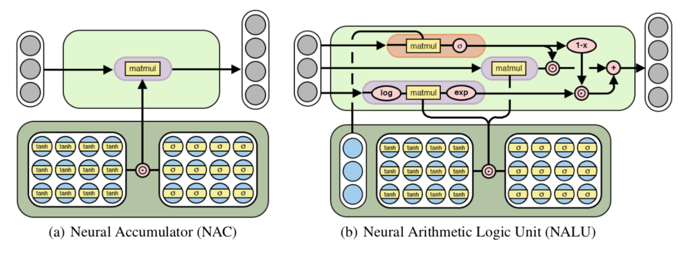

# Neural Arithmetic Logic Units

[WIP]

This is a Keras implementation of [Neural Arithmetic Logic Units](https://arxiv.org/abs/1808.00508) by *Andrew Trask, Felix Hill, Scott Reed, Jack Rae, Chris Dyer and Phil Blunsom*.

<p align="center">
 
</p>

# Usage

Simply add them as normal layers after importing `nalu.py` or `nac.py`.

`NALU` has several additional parameters, the most important of which is whether to apply the gating mechanism or not

- `use_gating` is True by default, enabling the behaviour from the paper.
- Resetting `use_gating` allows the layer to model more complex expressions.

```python
from nalu import NALU


ip = Input(...)
x = NALU(10, use_gating=True)(ip)
...
```
# Requirements

- Tensorflow (Tested) | Theano
- Keras 2+
